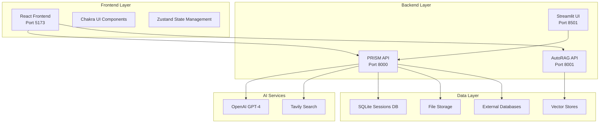

# PRISM Architecture Documentation

## Table of Contents
1. [Project Overview](#project-overview)
2. [System Architecture](#system-architecture)
3. [Frontend Architecture](#frontend-architecture)
4. [Backend Architecture](#backend-architecture)
5. [AutoRAG Module](#autorag-module)
6. [Data Flow](#data-flow)
7. [API Endpoints](#api-endpoints)
8. [Database Schema](#database-schema)
9. [Deployment](#deployment)
10. [Development Setup](#development-setup)

## Project Overview

PRISM (Predictive Research Intelligence and Statistical Modeling) is a comprehensive AI-powered data analysis platform that provides:

- **Data Insights**: Interactive chat-based data analysis with SQL generation and visualization
- **Predictive Modeling**: Automated ML pipeline generation and execution
- **AutoRAG**: Retrieval-Augmented Generation for document-based Q&A
- **Multi-format Support**: Excel, CSV, SQLite, PostgreSQL, MySQL data sources

### Key Features
- 🤖 **AI-Powered Analysis**: GPT-4 powered agents for data analysis
- 📊 **Interactive Visualizations**: Automatic plot generation with matplotlib
- 🔄 **Workflow Orchestration**: LangGraph-based state machines
- 💾 **Session Persistence**: SQLite-based session management
- 🎨 **Modern UI**: React + Chakra UI frontend
- 🔌 **Multi-Backend**: FastAPI + Streamlit backends

## System Architecture



## Frontend Architecture

### Technology Stack
- **Framework**: React 18 with TypeScript
- **UI Library**: Chakra UI v2.10.9
- **State Management**: Zustand v5.0.8
- **Routing**: React Router DOM v7.9.2
- **HTTP Client**: Axios v1.12.2
- **Build Tool**: Vite v7.1.7
- **Styling**: Emotion (CSS-in-JS)

### Project Structure
```
frontend/
├── src/
│   ├── api/
│   │   └── client.ts              # API client configuration
│   ├── components/
│   │   ├── branding/
│   │   │   └── Hero.tsx           # Landing page hero component
│   │   ├── Sidebar.tsx            # Main navigation sidebar
│   │   └── SplashScreen.tsx       # Loading screen component
│   ├── pages/
│   │   ├── AboutPage.tsx          # About page
│   │   ├── AutoRagPage.tsx        # AutoRAG interface
│   │   ├── InsightsPage.tsx       # Data insights chat
│   │   └── ModelingPage.tsx       # ML pipeline interface
│   ├── state/
│   │   └── appStore.ts            # Global state management
│   ├── theme/
│   │   └── theme.ts               # Chakra UI theme configuration
│   ├── types/
│   │   └── index.ts               # TypeScript type definitions
│   ├── App.tsx                    # Main application component
│   └── main.tsx                   # Application entry point
├── public/
│   ├── prism_logo.png             # Application favicon
│   └── vite.svg                   # Vite default icon
├── index.html                     # HTML template
└── package.json                   # Dependencies and scripts
```

### State Management

The application uses Zustand for state management with the following structure:

```typescript
interface AppStateShape {
  session_id: string;
  sources: Record<string, SourceState>;
  active_source_name: string | null;
  modeling: ModelingState;
  selected_rag_id?: string | null;
  editing_rag_id?: string | null;
  session_ids?: Record<string, string | null>;
  chat_histories?: Record<string, Array<ChatMessage>>;
}
```

### Key Components

#### 1. Sidebar Component
- **Purpose**: Data source management and navigation
- **Features**:
  - File upload (Excel, CSV)
  - Database connection (PostgreSQL, MySQL, SQLite)
  - Source analysis and activation
  - Session management
  - Collapsible sections

#### 2. Insights Page
- **Purpose**: Interactive data analysis chat
- **Features**:
  - Real-time chat interface
  - Plot generation and display
  - Step-by-step agent activity
  - Report export functionality

#### 3. Modeling Page
- **Purpose**: ML pipeline generation and execution
- **Features**:
  - Pipeline code generation
  - Requirements and README generation
  - Code execution and artifact management
  - Download functionality

#### 4. AutoRAG Page
- **Purpose**: Document-based Q&A system
- **Features**:
  - Document upload and processing
  - Vector store management
  - RAG-based conversations
  - Knowledge base management

## Backend Architecture

### PRISM API (Port 8000)

#### Technology Stack
- **Framework**: FastAPI
- **AI Integration**: OpenAI GPT-4, Tavily Search
- **Workflow Engine**: LangGraph
- **Database**: SQLite (sessions), SQLAlchemy (data sources)
- **File Processing**: pandas, openpyxl, xl2md
- **Visualization**: matplotlib

#### Core Services

##### 1. Data Processing Services
```python
class DataAnalysisService:
    def analyze_dataset(self, file_path: Path) -> str

class ExcelLoaderService:
    def get_sheets(self, file_path: Union[str, Path]) -> List[str]

class MarkdownConverterService:
    def convert(self, file_path: Union[str, Path], sheets: List[str]) -> str

class DBHandlerService:
    def get_schema_as_str(self) -> str
    def execute_query(self, query: str) -> pd.DataFrame
```

##### 2. AI Agents
```python
class BaseAgent:
    def invoke(self, user_prompt: str, llm_type: str = "fast") -> str

class SummarizerAgent(BaseAgent):
    def summarize(self, context: str) -> str

class RouterAgent(BaseAgent):
    def route(self, question: str, context: str, history: str, source_type: str) -> Dict[str, Any]

class SQLGeneratorAgent(BaseAgent):
    def generate(self, question: str, schema: str, dialect: str) -> str

class CodeGenAgent(BaseAgent):
    def generate(self, question: str, context: str) -> str

class InsightsAgent(BaseAgent):
    def generate(self, question: str, context: str, plot_info: str = "") -> str

class ModelingPlannerAgent(BaseAgent):
    def plan(self, task: str, data_context: str, source_type: str, data_profile: str) -> Dict[str, Any]

class ModelingCodeGenAgent(BaseAgent):
    def generate(self, plan: str, data_profile: str) -> str

class ModelingCorrectorAgent(BaseAgent):
    def correct(self, original_code: str, error_log: str) -> str

class ReportGeneratorAgent(BaseAgent):
    def generate(self, source_name: str, chat_history: str) -> str
```

##### 3. Workflow Orchestration

###### Data Insights Workflow
```python
class DataInsightsState(TypedDict):
    session_id: str
    question: str
    history: str
    data_source_config: Dict[str, Any]
    data_context: str
    summary: str
    router_decision: Dict[str, Any]
    sql_query: Optional[str]
    query_result: Optional[str]
    plot_code: Optional[str]
    plot_path: Optional[str]
    final_insight: str
    error: Optional[str]
    step_log: List[str]
```

**Workflow Steps**:
1. **Route**: Determine if SQL or plotting is needed
2. **SQL Generate**: Generate SQL query if needed
3. **SQL Execute**: Execute query against database
4. **Code Generate**: Generate visualization code if needed
5. **Code Execute**: Execute code and generate plots
6. **Insights**: Generate final AI insights

###### Predictive Modeling Workflow
```python
class PredictiveModelingState(TypedDict):
    session_id: str
    task_description: str
    source_config: Dict[str, Any]
    data_context: str
    dataset_path: str
    data_profile: str
    ml_plan: Dict[str, Any]
    requirements_txt: str
    readme_md: str
    generated_code: str
    execution_log: str
    artifacts: Dict[str, str]
    error: Optional[str]
    step_log: List[str]
    correction_attempts: int
```

**Workflow Steps**:
1. **Plan Pipeline**: Research and plan ML approach
2. **Prepare Data**: Extract data from database or use file
3. **Analyze Dataset**: Generate data profile and statistics
4. **Generate Code**: Create ML pipeline code
5. **Execute Code**: Run pipeline in sandbox
6. **Correct Code**: Self-correct if execution fails
7. **Generate Artifacts**: Save models and metrics

#### API Endpoints

##### Data Processing
- `POST /upload_file` - Upload files for processing
- `POST /process_source` - Process data sources (Excel, databases)

##### Data Insights
- `POST /invoke_insights` - Execute insights workflow
- `POST /export_insights_report` - Generate markdown reports

##### Predictive Modeling
- `POST /start_modeling_pipeline` - Generate ML pipeline
- `POST /execute_modeling_pipeline` - Execute generated pipeline

##### Session Management
- `GET /session/{session_id}` - Resume saved sessions

##### Static Files
- `GET /static/*` - Serve plots and artifacts

### Streamlit UI (Port 8501)

The Streamlit interface provides an alternative UI for the same functionality:

```python
# prism_ui.py
PRISM_BACKEND_URL = "http://127.0.0.1:8000"
AUTORAG_API_BASE_URL = "http://127.0.0.1:8001"
```

**Features**:
- Data source configuration
- Interactive chat interface
- Plot display
- Session management
- Report generation

## AutoRAG Module

### Architecture
```
modules/auto_rag/
├── src/
│   ├── api/
│   │   ├── main.py              # FastAPI application
│   │   └── routers.py           # API route definitions
│   ├── config/
│   │   ├── settings.py          # Configuration management
│   │   └── yml/                 # YAML configuration files
│   ├── core/
│   │   └── workflow.py          # RAG workflow orchestration
│   ├── database/
│   │   ├── dbservice.py         # Database operations
│   │   └── models.py            # Data models
│   ├── service/
│   │   ├── agents/              # AI agents
│   │   ├── modules/             # Processing modules
│   │   └── tools/               # Utility tools
│   └── utils/                   # Utility functions
├── uploaded_files/              # Document storage
├── vector_stores/               # Vector database
└── logs/                        # Application logs
```

### Key Components

#### 1. Document Processing Pipeline
- **Parsers**: PDF, DOCX, TXT, Markdown
- **Chunkers**: Recursive, Semantic chunking
- **Embedders**: HuggingFace, LiteLLM
- **Vector Stores**: Chroma, FAISS

#### 2. RAG Workflow
- Document ingestion and processing
- Vector store population
- Query processing and retrieval
- Response generation with sources

#### 3. API Endpoints
- Document upload and management
- RAG conversation endpoints
- Vector store operations
- Configuration management

## Data Flow

### 1. Data Source Configuration
```
User Uploads File/Configures DB
    ↓
Frontend sends to /upload_file or /process_source
    ↓
Backend processes and analyzes data
    ↓
Data context stored in session
    ↓
User can start analysis
```

### 2. Insights Generation
```
User asks question
    ↓
Router determines approach (SQL/Plot/Insight)
    ↓
If SQL: Generate → Execute → Get results
    ↓
If Plot: Generate code → Execute → Create plot
    ↓
Generate final AI insights
    ↓
Return to frontend with plots and insights
```

### 3. ML Pipeline Generation
```
User describes modeling task
    ↓
Planner researches and creates plan
    ↓
Prepare data (extract from DB or use file)
    ↓
Analyze dataset structure
    ↓
Generate ML pipeline code
    ↓
Execute in sandbox environment
    ↓
Self-correct if errors occur
    ↓
Return artifacts and results
```

## API Endpoints

### PRISM API (Port 8000)

#### Data Processing
- `POST /upload_file` - Upload files
- `POST /process_source` - Process data sources

#### Insights
- `POST /invoke_insights` - Generate insights
- `POST /export_insights_report` - Export reports

#### Modeling
- `POST /start_modeling_pipeline` - Start ML pipeline
- `POST /execute_modeling_pipeline` - Execute pipeline

#### Session
- `GET /session/{session_id}` - Get session data

#### Static Files
- `GET /static/plots/*` - Serve generated plots
- `GET /static/artifacts/*` - Serve ML artifacts

### AutoRAG API (Port 8001)

#### Documents
- `POST /documents/upload` - Upload documents
- `GET /documents` - List documents
- `DELETE /documents/{id}` - Delete document

#### RAG
- `POST /rag/chat` - RAG conversation
- `GET /rag/history` - Get chat history

#### Vector Stores
- `POST /vector-stores` - Create vector store
- `GET /vector-stores` - List vector stores
- `DELETE /vector-stores/{id}` - Delete vector store

## Database Schema

### Session Database (SQLite)
```sql
CREATE TABLE sessions (
    session_id TEXT PRIMARY KEY,
    state_json TEXT NOT NULL,
    created_at TIMESTAMP DEFAULT CURRENT_TIMESTAMP,
    updated_at TIMESTAMP DEFAULT CURRENT_TIMESTAMP
);
```

### Checkpoints Database (SQLite)
Used by LangGraph for workflow state persistence:
- Workflow execution states
- Agent conversation history
- Error logs and recovery points

### Data Storage Structure
```
data/
├── incoming/           # Uploaded files
├── processed/          # Processed data files
├── plots/             # Generated visualizations
├── artifacts/         # ML pipeline artifacts
├── prism_sessions.db  # Session database
└── checkpoints.db     # Workflow checkpoints
```

## Deployment

### Development Environment
```bash
# Backend
pip install -r requirements.txt
python prism_api.py

# Frontend
cd frontend
npm install
npm run start

# AutoRAG
cd modules/auto_rag
pip install -r requirements.txt
python app.py
```

### Production Considerations
- **Environment Variables**: Configure API keys and database URLs
- **Static File Serving**: Ensure proper CORS and file permissions
- **Database Migrations**: Handle schema updates
- **Monitoring**: Log aggregation and error tracking
- **Scaling**: Consider containerization with Docker

### Environment Variables
```bash
# Required
OPENAI_API_KEY=your_openai_key
TAVILY_API_KEY=your_tavily_key

# Optional
LOG_LEVEL=INFO
VITE_PRISM_BACKEND_URL=http://127.0.0.1:8000
VITE_AUTORAG_API_BASE_URL=http://127.0.0.1:8001
```

## Development Setup

### Prerequisites
- Python 3.8+
- Node.js 18+
- PostgreSQL/MySQL (for database sources)
- Git

### Quick Start
1. Clone repository
2. Install Python dependencies: `pip install -r requirements.txt`
3. Install frontend dependencies: `cd frontend && npm install`
4. Configure environment variables
5. Start backends: `python prism_api.py` and `python modules/auto_rag/app.py`
6. Start frontend: `cd frontend && npm run start`

### Project Structure Overview
```
PRISM/
├── frontend/              # React frontend
├── modules/auto_rag/      # AutoRAG microservice
├── prompts/               # AI agent prompts
├── data/                  # Data storage
├── bkp/                   # Backup versions
├── prism_api.py           # Main FastAPI backend
├── prism_ui.py            # Streamlit UI
├── requirements.txt       # Python dependencies
└── ARCHITECTURE.md        # This file
```

This architecture provides a scalable, maintainable platform for AI-powered data analysis with clear separation of concerns and modern development practices.
